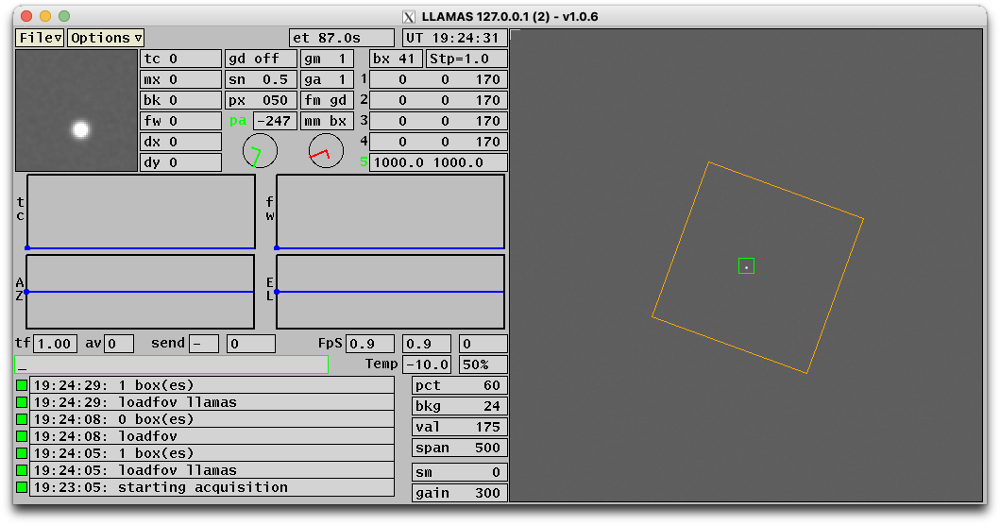

# gcam: `loadfov` — field-of-view overlays from a ds9 region file — Plan

**Status:** implemented on branch `feature/gcam-loadfov` (off
upstream `main`), built on macOS; awaiting on-sky test on Baade gcam2
with the LLAMAS example. Line references below are to that branch.

## What this is

A new zwogcam UI command that draws a set of geometric entities on top
of the live image, the same way the guide box and cursors are drawn:

```
loadfov [filename[.fov]]
```

- `loadfov NAME` opens `NAME` relative to gcam's working directory,
  which is its data path (`GCAMZWOPATH`, `/opt/gcamzwo` by default:
  gcam `chdir()`s there at start-up, `check_datapath()`), or as given
  when absolute, appending `.fov` when the name has no extension;
  replaces the current overlay set with the file's contents and
  redraws.
- `loadfov` with no argument erases all loaded entities and redraws.
- The overlay is drawn in **orange** (`app->orange`, already allocated
  by cxt); colour becomes a parameter in a later version, not this PR.
- Only one entity type is supported in this PR: the ds9 `box`.

The command is reachable from the command box in the GUI and, for
free, from the TCP command port (`handle_tcpip()` forwards unknown
verbs to `handle_command()`, [zwogcam.c:2890](../../src/gcam/zwogcam.c#L2890)).

## File format

One entity per line, [ds9 region syntax](http://spiff.rit.edu/tass/ds9/region.html):

```
box x y width height [angle]
```

- `x y` is the **centre** of the box, `width height` its full size,
  `angle` in degrees (optional, default 0).
- Blank lines and lines starting with `#` are ignored; so is any line
  whose first word is not `box` (this silently skips the
  `global ...` and `image`/`physical` header lines a ds9-saved file
  contains). Nothing else is validated.
- ds9 writes its own files as `box(x,y,w,h,a)`. Turning `(`, `)` and
  `,` into spaces before parsing makes both forms work for one line of
  code, so a region drawn in ds9 on a frame from the image server can
  be saved and loaded unchanged.

**Coordinate convention (assumption, confirm at review):** ds9 *image*
coordinates of the FITS that gcam itself serves and saves. Those are
1-based with (1,1) the centre of the first pixel, and FITS row 1 is
gcam's buffer row 0 (`fits_send()` writes the frame buffer as is). So
the loader stores `x-1, y-1` and the box lives in the same pixel frame
as the `xys` cursor coordinates. The buffer→FITS mapping is a pure
translation, so the ds9 rotation matrix applies unchanged; the
display flips (`flip_x`/`flip_y`) are applied after the overlay is
drawn, exactly as for the cursors, so the box flips with the image.

## Where the guide box is drawn today

The guide box, cursors and the gm5 arc are **not** X drawing calls:
they are painted straight into the 32-bit pixel buffer in
`create_image()` ([qltool.c:1263-1300](../../src/gcam/qltool.c#L1263-L1300))
with the tiny rasterisers `draw_rect()`, `draw_cross()`, `draw_arc()`
([qltool.c:918-984](../../src/gcam/qltool.c#L918-L984)), before the
flips, under `qlt->lock`. (The X-call version in `plot_frame()` is
`#if 0`.) Coordinates are frame pixels divided by `MulX`/`MulY` (the
frame-to-window scale set in `qltool_reset()`). The overlay goes in
the same place, so it needs no new event handling, no expose logic,
and redraws with every frame; `qltool_redraw(qlt,False)` repaints it
from the last frame when acquisition is idle (this is what `xys`
does, [zwogcam.c:1538](../../src/gcam/zwogcam.c#L1538)).

Colours in that path are X pixel values copied from `app->` into
file-statics in `qltool_create()`
([qltool.c:204-210](../../src/gcam/qltool.c#L204-L210)). cxt already
allocates black, white, grey, lgrey, red, green, blue, yellow and the
optional brown, orange, beige, antique. Of the ones no overlay uses,
orange is the readable choice on a dark frame (blue is too dark; red
is the saturation colour, yellow the guiding box, green the active
cursor). Add `orange = app->orange;` to that block; no new
allocation.

## Design

Three touch points, all small.

### 1. Data — `qltool.h`

```c
#define QLT_NFOV 64
typedef struct { float x,y,w,h,a; } FovBox;   /* frame pixels, deg */
...
  FovBox fov[QLT_NFOV]; int nfov;             /* load_fov overlay */
```

Fixed array, no allocation; `nfov = 0` in `qltool_create()`. 64 boxes
is far more than a FOV description needs; bump if ever hit.

### 2. Drawing — `qltool.c`

- `draw_line(p,c,iw,ih,x1,y1,x2,y2)` ([qltool.c:986](../../src/gcam/qltool.c#L986)): a DDA that plots clipped points,
  ~12 lines, next to `draw_rect()`. There is no arbitrary-segment
  helper today and a rotated box needs one; angle 0 uses the same
  path (no `draw_rect` special case, keeps it to one code path).
- `draw_fov(qlt,p0)` ([qltool.c:1000](../../src/gcam/qltool.c#L1000)): for each box compute the four corners
  `(±w/2, ±h/2)` rotated by `a` about `(x,y)`, divide by `MulX/MulY`,
  round, and draw the four edges. ~15 lines.
- One call in `create_image()` after the cursor loop and before the
  flips: `draw_fov(qlt,p0);`. Colour: `orange`.

### 3. Command — `zwogcam.c`

- `static void load_fov(Guider*,const char* par)` next to
  `load_mask()` (`load_fov()` at [zwogcam.c:2285](../../src/gcam/zwogcam.c#L2285)),
  same shape (build filename, `fopen`, `message(g,...,MSS_WARN)` on
  failure):

  ```c
  if (*par) { copy par; if (no '.' after the last '/') strcat(".fov"); fp=fopen(...); if (!fp) {warn; return;} }
  pthread_mutex_lock(&qlt->lock);        /* create_image() reads fov[] */
  n = 0;
  while (fp && n < QLT_NFOV && fgets(line,...)) {
    for (p=line; *p; p++) if (strchr("(),",*p)) *p = ' ';
    FovBox b = {0};
    if (sscanf(line,"box %f %f %f %f %f",&b.x,&b.y,&b.w,&b.h,&b.a) >= 4) {
      b.x -= 1; b.y -= 1; qlt->fov[n++] = b;          /* ds9 1-based */
    }
  }
  qlt->nfov = n;
  pthread_mutex_unlock(&qlt->lock);
  if (fp) fclose(fp);
  qltool_redraw(qlt,False);
  sprintf(msgstr,"%d box(es)",n);       /* shows in the message line */
  ```

  No argument → `fp == NULL` → `nfov = 0` → redraw. Same function, no
  second branch. Take the lock *before* touching `fov[]` and release it
  before `qltool_redraw()` (which locks it itself).

- One `else if (!strcasecmp(cmd,"loadfov")) load_fov(g,par1);` in
  `handle_command()`, near `lut`/`curcol`
  ([zwogcam.c:1580](../../src/gcam/zwogcam.c#L1580)). No `strncasecmp`
  prefix in the chain starts with `lo`, so position is free.

### One parser change the path form needs

The verb is `loadfov`, not `load_fov`, on purpose: the `tf1 → tf 1`
splitter at the top of `handle_command()`
([zwogcam.c:1282-1295](../../src/gcam/zwogcam.c#L1282-L1295)) copies
letters only, so an underscore would split `load_fov x` into
`load _fov x`. Without the underscore the verb parses as is and the
splitter is untouched.

What remains is the length limit: only commands with
`strlen(command) < 32` are parsed at all; anything longer falls
through to `unknown command:`
([zwogcam.c:1741](../../src/gcam/zwogcam.c#L1741)). `loadfov llamas`
fits; `loadfov /home/obs/fov/llamas.fov` does not. Raise the limit to
`sizeof(buf)-2` (`buf` is 256; the splitter writes at most `strlen+2`
bytes). The GUI box already accepts 127 characters (`EDIT_SIZE`), and
`par1` is 128, so nothing else limits it. This is the only edit to a
shared code path in the PR; dropping it makes the PR purely additive
at the cost of paths longer than 23 characters failing with
`unknown command`.

## First real use: the LLAMAS IFU footprint on Baade gcam2

[etc/ini/baade_gcam/llamas.fov](../../etc/ini/baade_gcam/llamas.fov)
is the region this command exists for: a 35″ × 35″ square centred on
the gcam2 pixel that corresponds to the IFU pointing centre.

| quantity | value | source |
|---|---|---|
| frame | 2000 × 2000 px, bin 2 | Baade gcam42 runs `mode 4` (`setup_m_switch`, [zwogcam.c:2809](../../src/gcam/zwogcam.c#L2809)) |
| pixel scale | 0.050″/px | `px 50` in [gcam42.ini](../../etc/ini/baade_gcam/gcam42.ini) |
| box size | 700 × 700 px | 35″ / 0.050″ |
| centre | gcam cursor 1048, 1008 → ds9 1049, 1009 | Magellan1 night report 2026-08-31 (GPr, LLAMAS); an earlier value 1108, 890 on 2024-12-03 was for the first target only |
| angle | 200° | expected fixed, gcam is on the rotator with the instrument; to be verified on sky |

The centre and the angle are engineering inputs and will move; the
file is the place to edit them, no code involved. The ini's `angle
235` is the guider-to-telescope axis angle used for guide corrections
and is unrelated to the box angle.

## Out of scope for this PR (next versions)

- `color=` per line or per file (ds9 `# color=magenta` / `global color=`).
- Other ds9 shapes (`circle`, `polygon`, `line`, `text`).
- Showing the overlay in the web viewer (`src/web/`): would need the
  box list exposed by gcam (e.g. in the `status` reply), never derived
  client-side (see the *viewers display verbatim* memory).
- Auto-loading a per-instrument FOV from the `.ini` at start-up.

## Verification



*llamas.fov loaded on gcamzwo against the ZWO emulator (2026-09-03):
the 700 px box at 200°, the guide box at the frame centre, and the
message log for `loadfov llamas` → `1 box(es)` and `loadfov` → `0 box(es)`.*

Screen recording of the same session: [loadfov-llamas-sim.mp4](../images/loadfov-llamas-sim.mp4) (12 s).

Build on macOS with the makefile as is (`make` in `src/gcam`, the
active config is the macOS block). Then, against the emulator rig or a
live zwoserver:

1. Write `test.fov` in the cwd:
   ```
   # Region file format: DS9 version 4.1
   image
   box 300 300 100 60
   box(500,400,80,80,30)
   ```
2. `loadfov test` → message `2 box(es)`; an axis-aligned and a 30°
   rotated orange box appear; they move with `lmag`, flip with
   `flip_x/flip_y`, and persist across frames while guiding.
3. `loadfov` → message `0 box(es)`, both gone.
4. `loadfov nothere` → warning `failed to load nothere.fov`, previous
   overlay unchanged.
5. Same three commands over the TCP command port
   (`echo "loadfov test" | nc host PORT`) to confirm the TCP path.
6. A box at `box 1 1 …` is centred on the top-left buffer pixel (the
   1-based convention).
7. Regression: `tf1`, `xys 1 100 100`, `mask on` still parse (length
   change).

## Deliverables in the PR

- `src/gcam/qltool.h`, `src/gcam/qltool.c`, `src/gcam/zwogcam.c` as
  above; roughly 60 lines added, 1 line changed.
- `docs/ZWO/zwogcam.html`: a `loadfov` entry in the command `<dl>`
  next to `mask` ([zwogcam.html:690](../../docs/ZWO/zwogcam.html#L690)),
  with the file format and the 1-based note.
- Release note for the next tag (`P_VERSION` in `zwogcam.h`, currently
  1.0.6; since v1.0.5 changes are recorded in the GitHub release
  notes, not the header comment).
